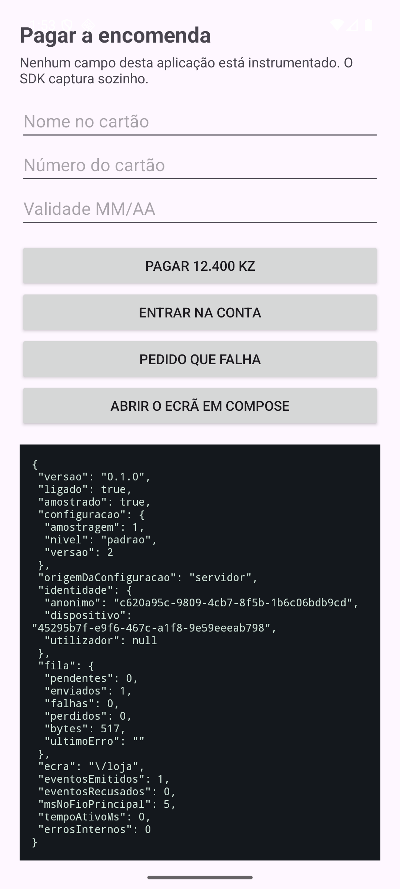

# sdk-android

> Peça do workspace **[ux-data-analysis](https://github.com/nerdy-nomads/ux-data-analysis)**, onde vive como
> submódulo em `sdk/sdk-android`. O plano, o quadro e o documento de arquitetura estão lá.

O SDK nativo para Android, com os mesmos eventos e o mesmo contrato do `sdk-js`.

A integração é **uma linha**, e não é código: é uma entrada no manifesto.

```xml
<meta-data android:name="io.uxda.chave" android:value="uxda_pro_..." />
```

O SDK arranca sozinho, por um `ContentProvider` que o sistema cria antes de a
aplicação correr. Sem isso, era preciso mexer no `Application` de quem nos
instala, e a promessa do `RF-CAP-01` deixava de valer no Android.

## Paridade com o web, e porquê

A mesma tarefa executada na web e no Android tem de produzir **sequências de eventos
comparáveis passo a passo**. Não é estética: se os dois divergirem, a comparação
entre a aplicação móvel e o sítio Web da mesma organização (`RF-ADM-10`) morre antes
de nascer, e essa é uma capacidade que quase ninguém tem.

O que garante a paridade não é a intenção, são três coisas verificadas:

| O quê | Como se garante |
|---|---|
| Os nomes dos campos | O esquema canónico vem do `uxda-core` pelo `sync-schema.sh`, e um ensaio falha se um campo emitido não existir lá |
| Os tipos de evento | A lista dos dez do `RF-CAP-04` é a mesma constante, e o ensaio compara-a letra a letra com a do web |
| As contas | O resumo do rótulo e a decisão de amostragem têm vetores fixos, tirados do `sdk-js` e do `hash/fnv` do Go |

## O que é diferente do web, e obrigou a trabalho próprio

| Evento | Na web | Aqui |
|---|---|---|
| `ecra` | mudança de URL | ciclo de vida da atividade, e dos fragmentos quando existem |
| `toque` | `click` no documento | `dispatchTouchEvent` da janela, com a vista debaixo do dedo |
| `tecla` | primeira tecla no campo | primeira alteração do texto depois do foco, porque **um teclado virtual não envia teclas** |
| `submissao` | evento `submit` | ação do teclado (Enviar, Seguinte, Concluído), encadeada sem tirar a da aplicação |
| `erro` | evento `invalid` | `setError` visível num campo, que é o mecanismo da plataforma |
| `recuo` | `popstate` | tecla de retroceder, e atividade a terminar com outra a retomar |
| `erro_rede` | `fetch` embrulhado | intercetor de OkHttp opcional, ou `Uxda.erroDeRede` |

E duas diferenças que não são de evento nenhum:

- **O sistema mata processos.** A fila é um ficheiro JSONL a acrescentar, e não um
  documento reescrito: gravar um evento é acrescentar uma linha. Se o processo
  morrer no instante seguinte, o que já foi escrito está escrito.
- **O sinal do destino quase não existe.** Uma vista não tem `href`. A cadeia de
  identidade fica com quatro sinais na prática, e a taxa de sobrevivência mede o
  efeito disso em vez de o adivinhar.

## Identidade de elementos, e o problema do Compose

Em vistas clássicas a cadeia é a mesma da web, com o identificador de recurso no
lugar do `data-testid`: quase toda a gente o põe, e não por virtude, é preciso para
escrever o esquema.

**Em Compose não há vistas.** Há uma única `AndroidComposeView` com o ecrã inteiro
lá dentro, e sem fazer nada todos os toques de um ecrã dariam o mesmo elemento. O
SDK lê a **árvore semântica**, que é a mesma que o leitor de ecrã lê e que os testes
de interface usam. Duas consequências, e as duas são boas: um ecrã acessível é um
ecrã bem identificado, e quem já pôs `testTag` para testar não tem de fazer nada.

Visto a correr no emulador, três toques em Compose deram três identidades
distintas: `testTag=botao-pagar`, `button#0` (o botão sem etiqueta, identificado
pelo papel e pelo texto) e `testTag=campo-nome`.

## O que o programador pode fazer para ajudar, sem ser obrigado

Nada disto é necessário. Tudo isto melhora a estabilidade da identidade:

| Gesto | O que muda |
|---|---|
| `android:id="@+id/botao_pagar"` | Passa a ser o sinal mais forte, e sobrevive a qualquer mudança de esquema |
| `Modifier.testTag("botao-pagar")` | O mesmo, em Compose |
| `contentDescription` nos ícones | Dá rótulo a quem não tem texto, e serve o leitor de ecrã ao mesmo tempo |
| `android:tag="uxda:destino=/checkout"` | Recupera o sinal do destino, que no Android não existe naturalmente |
| `android:tag="uxda:mensagem=saldo_insuficiente"` | Dá **chave** a uma mensagem, e aí o texto dela nem sai do dispositivo |
| `android:id="@+id/erro_saldo"` | O nome do recurso classifica a mensagem sozinho: `erro_`, `aviso_`, `sucesso_` |

## Mensagens: dê-nos a chave, e o texto não sai do dispositivo

O SDK apanha sozinho o que a aplicação mostra: vistas cujo nome de classe ou de
recurso diz o que são (`Snackbar`, `alert`, `erro_saldo`, `aviso_ligacao`), o corpo
de um diálogo da plataforma, e o `setError` de um campo. Classifica em **erro,
aviso, sucesso e informação**, e separa os erros em **validação num campo, operação
e sistema**, que é a diferença entre três equipas que fazem trabalho diferente.

Quando a aplicação diz qual é a mensagem, o resultado é melhor em três frentes ao
mesmo tempo, e é por isso que vale a pena:

```kotlin
// Uma etiqueta, e não muda nada no que a pessoa vê.
aviso.tag = "uxda:mensagem=saldo_insuficiente"
// Ou, para o que o SDK não vê sozinho (um Toast, uma notificação):
Uxda.mensagem("saldo_insuficiente", "erro")
```

| Sem chave, só com texto | Com chave |
|---|---|
| O texto sai, **mascarado** | **O texto não sai de todo.** Não há nada para mascarar nem para arriscar |
| A mesma mensagem em português e em inglês dá **duas entradas** no catálogo | Dá **uma**, e a contagem é a verdadeira |
| Mudar a redação parte a série histórica | A série sobrevive a qualquer reescrita |
| A mascaragem é uma heurística, e mascara a mais | Não há heurística nenhuma pelo meio |

E quando não há chave, o texto sai assim, medido no emulador
(`ferramentas/mensagens-medido.txt`):

```
O saldo de 12.400,50 Kz do documento 005123456LA041 nao chega para Ana Maria da Silva em 2027-03-14
→ O saldo de {numero} Kz do documento {id} nao chega para {nome} em {data}
```

Tudo isto acontece **no dispositivo, antes de qualquer envio**, e a ingestão volta a
verificar: um texto que chegue com um arroba ou com cinco algarismos seguidos é
recusado, e não mascarado do outro lado. O desenho inteiro está no
[ADR 0020](../../docs/adr/0020-mensagens-a-chave-o-texto-e-o-chao-da-mascaragem.md).

## O que nunca faz

- **Não faz a aplicação anfitriã falhar.** Todos os pontos de entrada passam pela
  barreira do `RNF-SDK-01`, e ela apanha `Throwable` e não `Exception`: um
  `NoSuchMethodError` de outra versão do Compose mata o processo na mesma.
- **Não regista conteúdo de campos.** Num `EditText` lê a dica e a descrição, nunca
  o texto. Em Compose lê `Text`, nunca `EditableText`.
- **Não bloqueia o fio principal.** A escrita em disco e o envio correm num fio
  próprio.
- **Não ignora a rede medida nem a poupança de bateria.** Abranda em vez de
  desligar: desligar daria dados com buracos exatamente nos utilizadores com pior
  ligação, que são os que mais abandonam.
- **Não leva dependências.** Nenhuma em tempo de execução. O Compose, o OkHttp e a
  `RecyclerView` são dependências de compilação: quem os usa ganha a integração, quem
  não os usa não leva um byte deles por nossa causa.
- **Não fotografa o ecrã.** Não é uma promessa: é o `SemEcraTest`, que percorre o
  código publicado e falha se encontrar `PixelCopy`, `MediaProjection`,
  `drawToBitmap`, `getDrawingCache`, `Canvas(` ou mais cinco. O mapa de calor do
  cartão `9.2` desenha-se sobre um esquema reconstruído das caixas que os toques
  observaram, e nunca sobre uma imagem.

## Estado: existe, corre num emulador a sério, e está medido

Os cartões `3.1` a `3.4` estão fechados.

| Caminho | O que é |
|---|---|
| `uxda/src/main/kotlin/io/uxda/sdk/Uxda.kt` | A API pública, e o arranque. `track`, `identificar`, `ecra`, `erroDeRede`, `parar`, `diagnostico` |
| `.../UxdaProvider.kt` | O `ContentProvider` que arranca o SDK antes da aplicação |
| `.../captura/Captura.kt` | Os dez tipos do `RF-CAP-04`, e os onze pontos de entrada que correm no fio principal |
| `.../captura/Fragmentos.kt` | Ecrãs feitos de fragmentos, com o `androidx.fragment` só em compilação |
| `.../fila/` | A fila JSONL a acrescentar, o lote, o recuo e os limites de rede medida |
| `.../identidade/Elemento.kt` | Os cinco sinais em vistas clássicas |
| `.../identidade/ElementoCompose.kt` | Os mesmos sinais na árvore semântica fundida, por reflexão |
| `.../identidade/Mascara.kt` | O resumo do rótulo, regra a regra igual ao do web |
| `.../Seguranca.kt` | A barreira. Apanha `Throwable`, e não `Exception` |
| `exemplo/` | A mesma loja de ensaio da web, **sem uma linha de instrumentação**, em quatro variantes |

### Os números, medidos e não estimados

Todos no mesmo emulador de **um núcleo**, que é o que o cartão `3.4` exige: um
aparelho de gama alta esconde tudo o que se queria ver.

| O quê | Medido | Limite |
|---|---|---|
| Acréscimo ao APK da aplicação | **48 KB** | 300 KB (`RNF-SDK-03`) |
| Fio principal, por evento capturado | **0,40 ms** | 1 ms (`RNF-SDK-05`) |
| Bateria, uma hora de uso com e sem SDK | **+0,3% de CPU numa hora** | não mensurável (`RNF-SDK-04`) |
| Sobrevivência de identidades entre duas versões | **100% (9 de 9)** | - |
| Ensaios | 53, incluindo fuga de conteúdo e injeção de falhas | - |

**O que 0,3% vale, e é a parte que interessa.** A mesma variante **sem** SDK, em
duas horas seguidas do mesmo guião, gastou 101 510 ms e 94 230 ms de CPU: 7,7% de
diferença entre corridas iguais. A diferença entre as duas variantes foi de 280 ms,
0,3%. **O ruído da medição é vinte e cinco vezes maior do que o efeito**, e é essa
comparação, e não a percentagem sozinha, que responde ao `RNF-SDK-04`.

O consumo modelado por aplicação foi de 0,00342 mAh contra 0,00194 mAh na hora. Num
emulador o medidor não é físico: o total do sistema vem a zero e estes valores saem
do perfil de energia aplicado ao tempo de CPU, por isso são o mesmo número dito de
outra maneira. **O que falta é um telemóvel a sério, com rádio e ecrã**, e isso é o
cartão `20.2`.

E os primeiros eventos custam mais do que a média: carregar classes, a primeira
leitura da árvore e a primeira reflexão pagam-se uma vez. Sobre 8 eventos o fio
principal deu 5,2 ms por evento; sobre 203, deu 0,40.



### O que só apareceu por correr isto num emulador a sério

**Os fragmentos não eram detetados, e degradavam em silêncio.** A primeira versão
usava um `Proxy` dinâmico para não depender do `androidx.fragment`, e um `Proxy` só
sabe implementar interfaces: `FragmentLifecycleCallbacks` é uma classe abstrata.
Uma aplicação de uma atividade e vinte fragmentos aparecia como **um ecrã só**, que
é o mesmo defeito que as rotas em `#` deram na web.

**A identidade em Compose vinha vazia.** Estava a ler-se a árvore **crua**, onde o
`testTag` fica num nó e o texto noutro: o nó mais fundo debaixo do dedo saía sem
identidade nenhuma, e todos os toques do ecrã davam `compose#0`. Com a árvore
**fundida**, que é a que o leitor de ecrã lê, os mesmos três toques deram
`testTag=botao-pagar`, `button#0` e `testTag=campo-nome`.

**O fio principal custava quase o dobro do orçamento**, e a causa não era a leitura
da vista: era gerar o identificador do evento, que usa a fonte segura de
aleatoriedade do sistema, mais um formatador de datas e uma escrita nas preferências
por evento. O evento passou a ser construído no fio de fundo.

**E o cronómetro que media isso não estava ligado a nada.** Estava declarado, estava
documentado a dizer que incluía a leitura da vista, e ninguém lho passava: o número
descrevia só a construção do evento. Foi encontrado a reler o código depois da
medição, e obrigou a medir outra vez.

**Renomear um identificador de recurso destruía a identidade.** A regra dizia que
dois identificadores diferentes anulavam tudo, e uma versão nova que renomeia
`pagar` para `botao_pagamento` perdia o elemento. Corrigiu-se nos dois SDK e na
ingestão, que é quem decide.

## O rastreio individual: duas condições, e percentagens

As coordenadas de um toque, a caixa da vista em que ele caiu, a ordem da interação
dentro do ecrã e a profundidade de deslocamento **só saem com duas coisas ligadas**:
o nível **detalhado**, que diz quanta granularidade se capta, e o **rastreio
individual** do projeto, que diz se é legítimo seguir uma pessoa (`RF-IND-09`). Com
uma condição só, desligar o rastreio deixava de mostrar e continuava a recolher. A
zona continua a sair sempre: ela agrupa e não localiza ninguém.

**A profundidade em Android mede-se de duas maneiras**, porque o `View` esconde os
três números em métodos protegidos: uma `RecyclerView` volta a torná-los públicos (e é
por isso que ela entra como dependência **de compilação apenas**), e um `ScrollView`
tem um filho só, cuja altura é a do conteúdo. Quando nenhum dos dois sabe responder,
**não se inventa**: fica o que se sabe com certeza, que é ter chegado ao fim ou não.

A conta final é a mesma da web, e é isso que faz os dois mapas serem comparáveis. A
paridade não é intenção: é medida pelo `./scripts/paridade.sh`.

## O componente de avaliação: um cartão por baixo, que não bloqueia nada

Fase 14, cartões `14.1` e `14.2`, com o mesmo contrato do web
([`docs/contrato-das-respostas.md`](../../docs/contrato-das-respostas.md)) e as mesmas
regras ([ADR 0034](../../docs/adr/0034-uma-resposta-e-anonima-ate-alguem-decidir.md)).

**Nenhuma linha na aplicação.** As regras chegam na configuração remota, e o SDK avalia os
gatilhos sobre os eventos que ele próprio emite: depois de concluir uma tarefa, depois de
a abandonar (no arranque da sessão seguinte, e o estado sobrevive à morte do processo),
depois de um erro, na primeira utilização neste dispositivo, ou por amostragem. Quem quiser
pedir pelo código chama `Uxda.inquerito(chave)`, que salta o sorteio e mais nada.

| Peça | O que faz |
|---|---|
| `.../inquerito/ConfiguracaoDosInqueritos.kt` | Lê o bloco `inqueritos` à defesa: lixo dá uma lista vazia, e a configuração da captura fica |
| `.../inquerito/Condicoes.kt` | Os critérios das definições de tarefa, com os mesmos oito operadores do `core/definition` |
| `.../inquerito/Gatilhos.kt`, `FadigaLocal.kt` | Os cinco gatilhos, e a primeira linha da fadiga. **Quem decide é o servidor** |
| `.../inquerito/Inqueritos.kt`, `Corpos.kt` | O caminho inteiro: sorteio, fadiga, elegibilidade fora do fio principal, cartão, envio com uma repetição |
| `.../inquerito/CartaoDoInquerito.kt` | O cartão, com o tema da instituição e áreas de toque de 48 dp |
| `.../captura/VistaDoSdk.kt` | A marca que a captura respeita: o cartão nunca é um toque, um campo ou uma submissão da aplicação |

**As regras que não se dobram**, cada uma com ensaio:

- **Uma em dez por omissão**, e nunca dois inquéritos na mesma sessão. Sem resposta do
  servidor, não se mostra.
- **Não bloqueia.** O cartão entra no fundo do ecrã, sem escurecer o resto nem roubar o
  foco: os botões por cima dele continuam a responder, e há captura disso
  (`exemplo/ensaio-inquerito-nao-bloqueia.png`). Uma rotação retira o cartão e larga a
  atividade, para não a prender.
- **O comentário sai mascarado**, com a máscara das mensagens e o chão que o servidor
  exige. A bateria de fuga (`InqueritoFugaTest`) enche a loja de segredos, responde com um
  cartão e um correio no comentário, e procura-os em tudo o que sai.
- **Um defeito do cartão não parte a aplicação nem para a captura**, pela barreira do
  `Seguranca.kt`.

**Visto no emulador duas vezes.** Contra um duplo do contrato (`ferramentas/stub-inqueritos.py`),
com o esforço e a escolha, e depois contra a ingestão verdadeira, com a escolha múltipla e
a recomendação de 0 a 10: as duas respostas chegaram à tabela com o tema da consola no
cartão. O registo das duas passagens, e os dois defeitos que a primeira apanhou, estão em
`ferramentas/inqueritos-medido.txt`.

## Como correr

```bash
./gradlew :uxda:testDebugUnitTest --max-workers=3   # 160 ensaios, incluindo fuga e injeção de falhas
./ferramentas/orcamento.sh             # o acréscimo ao tamanho da aplicação
./ferramentas/ensaio-dispositivo.sh    # morte do processo e dia sem rede, num telemóvel
./ferramentas/ensaio-bateria.sh 60     # bateria e CPU, com e sem SDK, no mesmo aparelho
```

A aplicação de ensaio tem duas variantes do **mesmo** código, `com` e `sem` SDK. É
o que torna honesta a medição do acréscimo de tamanho e a de bateria: a diferença
que sobra é o SDK, e não a sorte.

```bash
./gradlew :exemplo:installComDebug -PuxdaChave=uxda_des_... -PuxdaServidor=http://10.0.2.2:8710
```

## Ler antes de mexer

[ADR 0018](https://github.com/nerdy-nomads/ux-data-analysis/blob/master/docs/adr/0018-o-sdk-web-uma-linha-e-uma-fila.md),
que fixa o desenho dos dois SDK, e o
[ADR 0003](https://github.com/nerdy-nomads/ux-data-analysis/blob/master/docs/adr/0003-identificacao-estavel-de-elementos.md),
que fixa a cadeia de sinais e a regra que manda sobre todas: **quando não se
reconhece, o elemento aparece como novo, e nunca como outro.**
